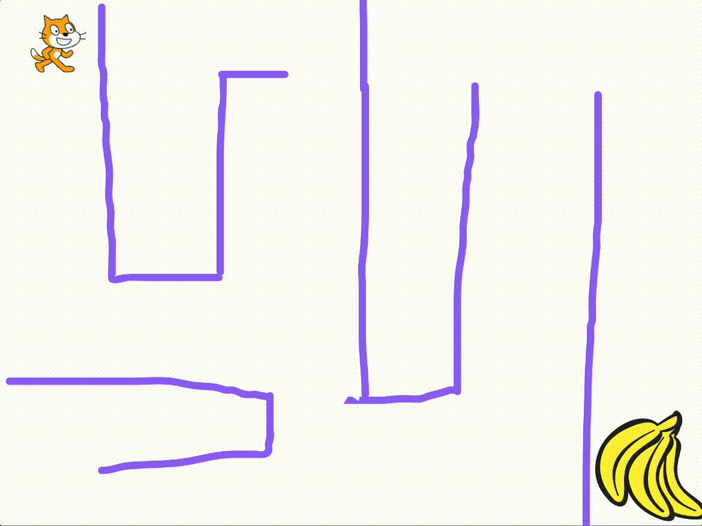

# きょうのミッション（20分）— めいろゲームをつくろう！

  

> **ゴール**  
> ねこを上下左右に動かして、壁をよけながらゴールにたどりつくゲームをつくろう！

**今日の流れ（全4ステップ）**
1. ねこ（プレイヤー）を動かそう  
2. ゴールを設置しよう  
3. めいろを描こう  
4. 壁で止まるしくみを作ろう

> **ヒント**  
> うまくいかないときは、いったん止めてブロックのつなぎ順をもう一度見てみよう。
