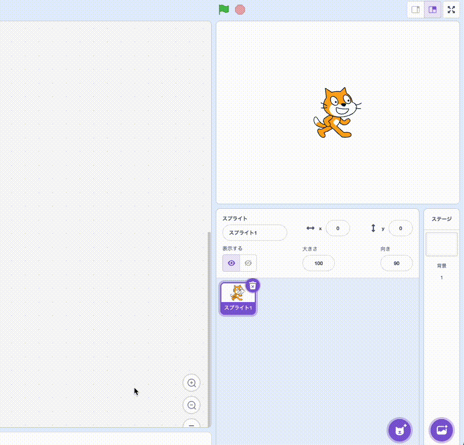
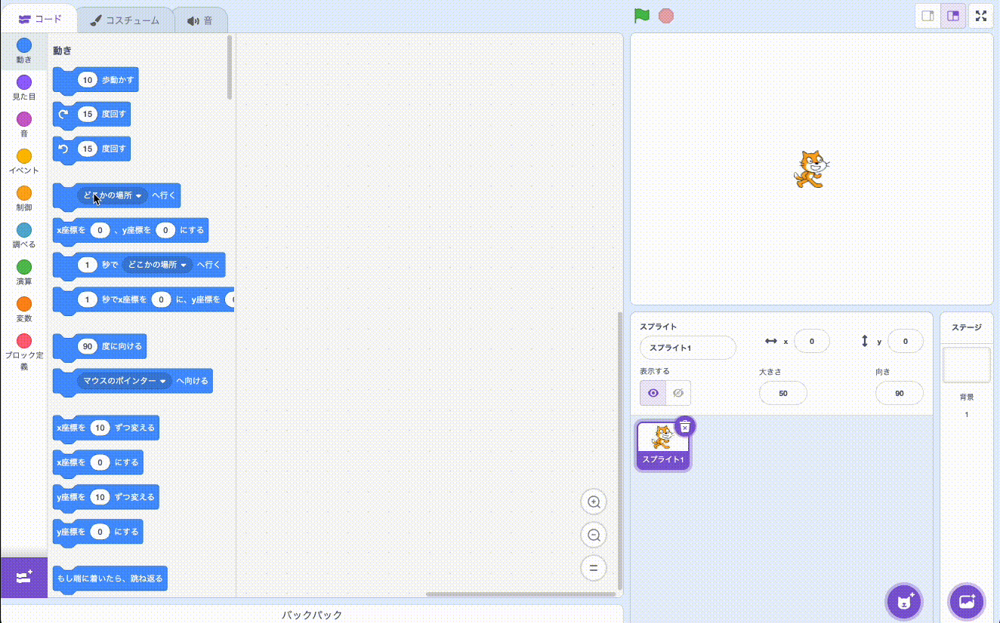
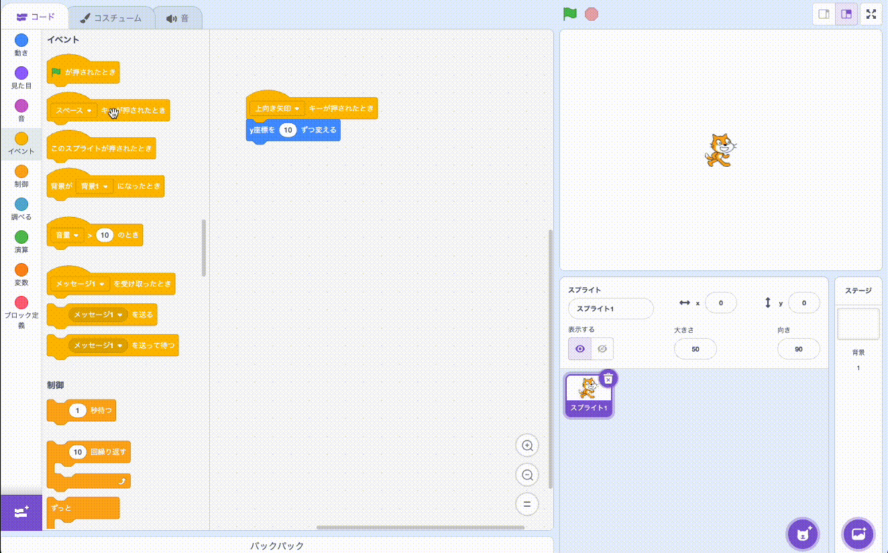
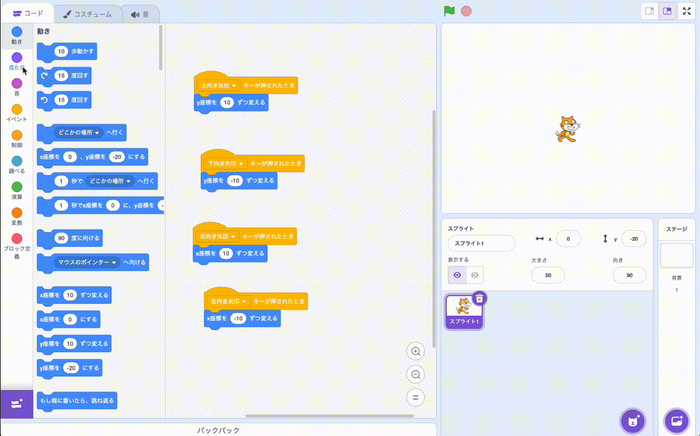
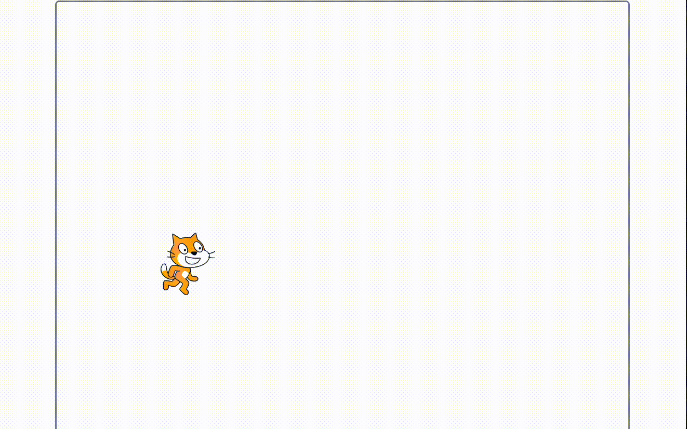

# Step 1：ねこを動かそう（上下左右＋歩くアニメ）

## 1) ねこの準備
- ねこのスプライトを選択

- **大きさ**を 50〜70 に調整

  

## 2) 上下左右に動く

### 2-1) まず上に動くようにしよう

- **「[上向き矢印キー] が押されたとき」 → 「y座標 を 10 ずつ変える」**を作ろう！

  

### 2-2) 同じように下、右、左を作ろう

- [下向きキー矢印キー] が押されたとき → **y座標 を -10** ずつ変える 
> ⚠️**注意**⚠️
> 
> **下向きのときは、「マイナス」になっているよ**

  

- [右向きキー矢印キー] が押されたとき → **x座標 を 10** ずつ変える  
- [左向きキー矢印キー] が押されたとき → **x座標 を -10** ずつ変える
> ⚠️**注意**⚠️
> 
> **左右はY座標のブロックではなく、「X座標のブロック」をつかうよ**

  

## 3) 歩くアニメーションをつける
- 見た目パネルの**「次のコスチュームにする」**を、いままで作ったプログラムにつけよう

  

## 4) 最初の位置に自動でもどるようにしよう！

- はたが押された時、X座標を-200、Y座標を150にしよう、を作ろう

  

## Step1完成！

確認して次に進もう！

  

