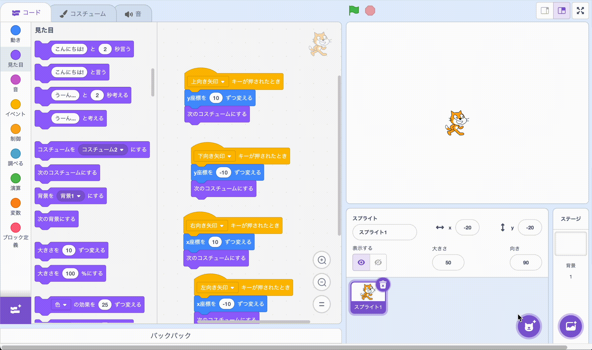
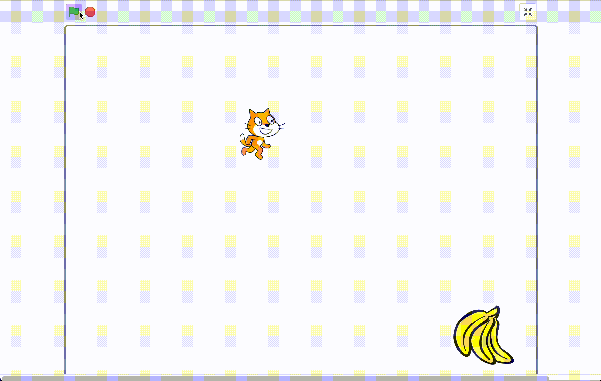

# Step 2：ゴールを設置しよう

## 1) ゴールのスプライトを追加
- 「スプライトを選ぶ」から **ゴール用** の絵を追加（動画ではバナナにしています）
- 大きさは調整して見やすく

  

## 2) ふれたら「ゴール！」

「ゴール」のスクリプトに、「はたが押された時、スプライト1がふれるまで待つ、ゴールという」プログラムを追加しよう

- はたが押された時
- **「スプライト1がふれるまで待つ」**
    - 「ゴール！」 という  

  

> ⚠️注意⚠️
>
> 緑色のはたボタンを押してからためそう！

## Step2完成！

確認して次に進もう！

  

