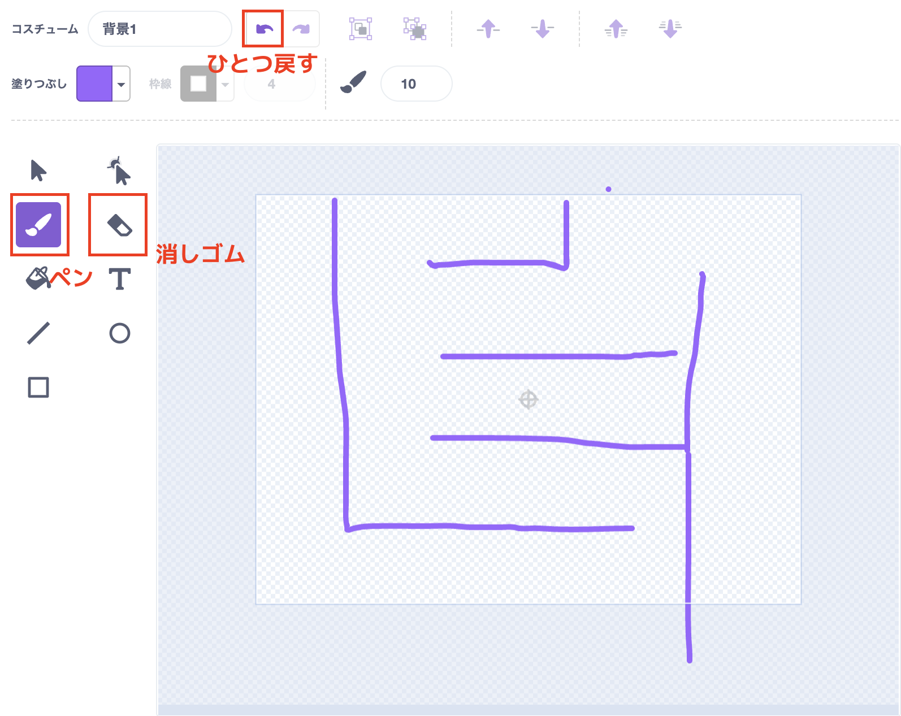

# Step 3：めいろを描こう（背景に描く）

## 1) 背景にめいろを描く

自由に迷路を描こう！

1. ステージ（背景）をクリック → 背景を編集
2. ねこが通れるように通路は広めに

  

> 
> ここではまだかべを通り抜けできて大丈夫だよ！
> 

### 参考：めいろを描くとき、つかうもの3つ

- ひとつもどすボタン：押すと一つ前のじょうたいになります
- ペン
- けしごむ

  

